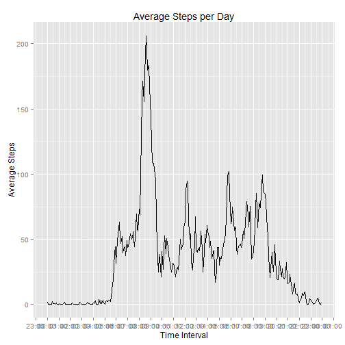
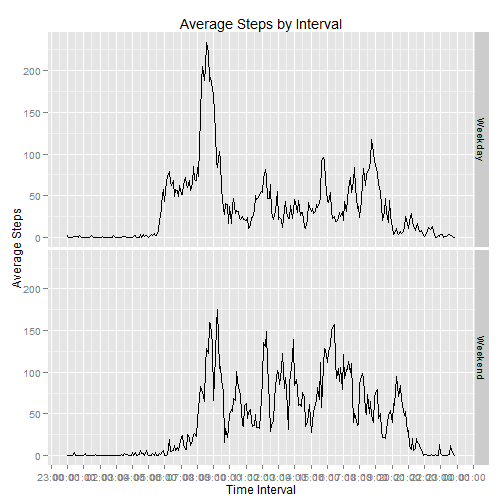

Load required R libraries


```r
library(dplyr)
library(ggplot2)
library(xtable)
library(scales)
library(stringr)
```
Load the data and convert to a table data frame


```r
setwd("C:/Users/echrist/Google Drive/Coursera/05-ReproducableResearch")
df_data <- read.csv(file="activity.csv", header=TRUE, sep=",")
dft_data <- tbl_df(df_data)
dft_data$date<-as.Date(dft_data$date, "%Y-%m-%d")
```
  
##What is mean total number of steps taken per day?


```r
# group data by day
dft_byDay <- group_by(dft_data,date)
# summarize number of steps
dft_byDay<-summarise(dft_byDay,totalSteps=sum(steps,na.rm = TRUE))
# plot 
plt<-qplot(x=date,y=totalSteps, xlab="Date", ylab = "Total Steps",stat="identity", data=dft_byDay, geom="histogram")
plt + ggtitle("Total Steps per Day")
```

 

```r
#cacluate mean and median daily total number of steps
dailyStepMean<-mean(dft_byDay$totalSteps)
dailyStepMedian<-median(dft_byDay$totalSteps)
```
The mean total number of steps taken per day:  9354.2295082  
The median total number of steps taken per day:  10395
  
##What is the average daily activity pattern?

```r
# group data by interval
dft_byInterval <- group_by(dft_data,interval)
# average number of steps
dft_byInterval <- summarise(dft_byInterval,aveSteps=mean(steps,na.rm = TRUE))
# save a copy for later when we need to impute missing NAs
dft_byIntervalAve<-dft_byInterval
# convert interval to POSIXct time
dft_byInterval$interval<-str_sub(paste("000",dft_byInterval$interval,sep=""),-4,-1)
dft_byInterval$interval<-as.POSIXct(dft_byInterval$interval,format="%H%M")
# plot
plt<-qplot(x=interval,y=aveSteps, xlab="Time Interval", ylab="Average Steps",stat="identity", data=dft_byInterval, geom="line")
# - add title
plt<- plt + ggtitle("Average Steps per Day")
# - add time series scale
plt<- plt + scale_x_datetime(labels = date_format("%H:%M"),breaks = "1 hour")
plt
```

 

```r
# get maximum average for any interval
maxAve<-max(dft_byIntervalAve$aveSteps)
# get interval for the maximum average
maxAveInterval<-as.integer(dft_byIntervalAve[dft_byIntervalAve$aveSteps==maxAve,1])
```
The Interval with the maximum average number of steps taken :  835

##Imputing missing values

```r
# get number of step values with NA
numNA<-sum(is.na(dft_data$steps))
```
The number of NA values for steps is :  2304


```r
# Impute NA values with the average number of steps for that interval
# - first join data to interval average on interval
dft_dataImputed<-inner_join(dft_data, dft_byIntervalAve)
```

```
## Joining by: "interval"
```

```r
# - second create new column, use steps if available if not use interval average
dft_dataImputed$stepsImputed<-dft_dataImputed$step
dft_dataImputed[is.na(dft_dataImputed$stepsImputed),"stepsImputed"] <-dft_dataImputed[is.na(dft_dataImputed$stepsImputed),"aveSteps"]

# group imputed data by day
dft_byDayImputed <- group_by(dft_dataImputed,date)
# summarize number of steps
dft_byDayImputed<-summarise(dft_byDayImputed,totalSteps=sum(stepsImputed,na.rm = TRUE))
# plot 
plt<-qplot(x=date,y=totalSteps, xlab="Date", ylab = "Total Steps",stat="identity", data=dft_byDayImputed, geom="histogram")
plt + ggtitle("Total Steps per Day (replacing NA with interval average)")
```

 

```r
#cacluate mean and median daily total number of steps
dailyStepMeanImputed<-mean(dft_byDayImputed$totalSteps)
dailyStepMedianImputed<-median(dft_byDayImputed$totalSteps)
```
The mean total number of steps taken per day (with NA replaced by interval average) :  1.0766189 &times; 10<sup>4</sup>  
The median total number of steps taken per day (with NA replaced by interval average):  1.0766189 &times; 10<sup>4</sup>


*The difference of mean and median values when imputing NA versus ignoring NA*  
mean: 1411.959171  
median 371.1886792


##Are there differences in activity patterns between weekdays and weekends?

```r
# copy the original data frame
dft_data2<-dft_data
# add a day of week column
dft_data2$dow<-weekdays(dft_data$date)
# add a weekend/weekday column
dft_data2$weekendOrWeekday<-ifelse(dft_data2$dow=="Sunday" | dft_data2$dow=="Saturday","Weekend","Weekday")
# convert column to a factor
dft_data2$weekendOrWeekday<-as.factor(dft_data2$weekendOrWeekday)

# group data by interval
dft_byWeekendInterval <- group_by(dft_data2,weekendOrWeekday,interval)
# average number of steps
dft_byWeekendInterval <- summarise(dft_byWeekendInterval,aveSteps=mean(steps,na.rm = TRUE))

# convert interval to POSIXct time
dft_byWeekendInterval$interval<-str_sub(paste("000",dft_byWeekendInterval$interval,sep=""),-4,-1)
dft_byWeekendInterval$interval<-as.POSIXct(dft_byWeekendInterval$interval,format="%H%M")
# plot
plt<-qplot(x=interval,y=aveSteps, xlab="Time Interval", ylab="Average Steps",stat="identity", data=dft_byWeekendInterval, geom="line")
# - add title
plt<- plt + ggtitle("Average Steps by Interval")
# - format time series
plt<- plt + scale_x_datetime(labels = date_format("%H:%M"),breaks = "1 hour")
# - add facet
plt + facet_grid(weekendOrWeekday ~ .)
```

 
